# AI Audio Tour Agent

An interactive tour companion: a short story at each stop, questions that remember the conversation, and a plan that adapts when your time or interests change.

Licensed under the [Apache License 2.0](LICENSE). See [NOTICE](NOTICE) for modification details.

## Try it

Use Python 3.12.

```bash
git clone https://github.com/nexttokenlab/ai-audio-tour-agent.git
cd ai-audio-tour-agent
python3.12 -m venv .venv
source .venv/bin/activate
pip install -r requirements.txt
streamlit run ai_audio_tour_agent.py
```

Open the local URL printed by Streamlit. Choose **Try the Jaipur demo → Explore the sample tour** for a no-key walkthrough. Demo content and replies are scripted and clearly labeled; it performs no live research, speech generation or photo analysis.

For live tours, enter your OpenAI API key in the sidebar. Alternatively, copy `.env.example` to `.env` and set `OPENAI_API_KEY`. The key needs access and quota for the configured models and web search. Never commit `.env`.

## A demo worth trying

1. Open the Jaipur sample, read the short Hawa Mahal story and select a suggested follow-up.
2. Ask the guide; the exchange appears in **Tour notes**.
3. Finish a stop, then skip the next one. The session tracks both independently.
4. In **Change the plan**, set 10 minutes and enter “I’m tired and I want coffee.”
5. Apply the change. The sample adds an explicitly unverified café break, reallocates the time and excludes completed/skipped places.

In live mode, a change triggers fresh research and a new source-backed plan. Constraints without evidence are acknowledged rather than presented as verified.

## Capabilities

| Capability | Behavior |
|---|---|
| Stop-based narration | Short, on-demand audio for each stop, welcome and conclusion |
| Budget allocation | Planner weights become positive integer allocations that exactly sum to the budget |
| Specialist research | Concurrent research for selected interests |
| Conversation | Follow-up questions, session memory, suggested prompts, voice recordings and optional photos |
| Adaptive planning | Replanning with visited/skipped exclusions and a user-updated remaining budget |
| Source provenance | Clickable references extracted from provider citation annotations |
| Voice customization | Style affects story prompts and TTS instructions; three selectable voices |
| Session isolation | Per-request clients with an explicit key; in-memory session audio |
| Automated verification | State, agent boundary, audio and Streamlit interaction tests; GitHub Actions |

## Result-quality improvements

- Research text carries stable source IDs next to provider-cited claims, so planning and narration can associate a fact with its reference.
- Questions use up to four relevant reports, recent conversation and three recent stories. Archive-only references are kept for display, not treated as evidence.
- When the companion identifies missing facts or volatile details, it performs at most one targeted search and answers again. If that remains insufficient, it explicitly abstains. This adds calls only when the model requests more evidence; it is not a factuality guarantee.
- An empty, uncited, overlong or poorly structured story gets one revision attempt before bounded fallback or an actionable error. Successful stories remain cached.
- Recent follow-up research is retained for reuse; older report bodies are dropped while citation provenance survives.

## Architecture

```mermaid
flowchart TD
    UI[Streamlit: location, interests, budget] --> M[Python session coordinator]
    M --> R[Selected research agents, concurrently]
    R --> W[Web search with citation annotations]
    W --> P[Structured tour planner]
    P --> V[Code validates sources, exclusions and budget]
    V --> S[Session: plan, current stop, visited, skipped, memory]
    S --> N[Short story agent]
    N --> T[On-demand speech]
    S --> Q[Question agent: text, transcribed voice, optional image]
    Q --> S
    S --> C[User changes time or preferences]
    C --> R
```



The coordinator controls the workflow; agents interpret requests, research places and compose responses. Code enforces budgets, handles transitions and isolates sessions. Structured output is not a truth guarantee: references are checked for provenance, not for semantic entailment of every generated sentence.

See [ARCHITECTURE.md](ARCHITECTURE.md) for state transitions, failure behavior, privacy and extension points.

## Voice and images

- **Generate audio** prepares only the selected passage. Playback is user-controlled; MP3s can be downloaded.
- **Record a question → Use this recording** transcribes speech into the editable question field. Review it, then press **Ask question**. Microphone capture requires localhost or HTTPS and browser permission.
- Add a JPEG/PNG to ask about a visible detail. Images are size-limited, resized and re-encoded to remove metadata before being sent to OpenAI. They are not saved by the app.
- Photo answers distinguish visible observations from sourced historical claims. This is not reliable landmark identification from an image alone.
- This is recorded-turn voice interaction, **not realtime barge-in or automatic playback resumption**. Pause narration before recording.

## Configuration

| Variable | Default | Purpose |
|---|---|---|
| `OPENAI_API_KEY` | none | Live mode credentials |
| `TOUR_MODEL` | `gpt-4.1-mini` | Research, narration and answers |
| `TOUR_PLANNER_MODEL` | same as `TOUR_MODEL` | Structured plan generation |
| `TOUR_TTS_MODEL` | `gpt-4o-mini-tts` | Speech output |
| `TOUR_TRANSCRIPTION_MODEL` | `gpt-4o-mini-transcribe` | Recorded question transcription |

Choose models supporting the capabilities used here: Responses API, web search, structured output and image input as appropriate. Model availability depends on your account. The SDK integration follows the official [web-search](https://developers.openai.com/api/docs/guides/tools-web-search), [structured-output](https://developers.openai.com/api/docs/guides/structured-outputs), and [speech](https://developers.openai.com/api/docs/guides/text-to-speech) documentation.

## Verify

```bash
pip install -r requirements-dev.txt
ruff check .
pytest -q
```

Tests make no paid API calls. They cover the demo journey, welcome/conclusion, weighted budgets, duplicate/source filtering, transactional replanning, memory and audio isolation, bounded speech, and mocked API behavior. Live factual quality, model access, speech quality and browser microphone support require an API-backed acceptance run.

Manual live acceptance: create a small-area tour; open its references; listen to one story in two styles; ask a contextual question; record/transcribe a question; attach a landmark detail; finish a stop; replan for ten minutes and coffee; confirm no visited stop returns and the budget totals ten. Try an invalid key and verify the existing tour survives the error.

## Current boundaries

- The time budget covers listening and exploration; it is manually updated. There is no GPS, verified route, opening-hours feed, weather feed or automatic movement detection. Do not treat suggested stop order as walking directions.
- Research links provide traceable provenance, not guaranteed factual accuracy or current venue availability. A source-backed place may still be closed, distant or unsuitable.
- Visit-name normalization blocks exact/case/punctuation duplicates. Alias exclusion additionally relies on planner instructions; robust place identity needs a places provider.
- Memory is session-only; the latest 20 conversation messages are kept. Browser-session loss clears the tour. There is no database or cross-device resume.
- There is no authentication layer. Run locally; add authentication, per-user quotas and HTTPS before multi-user deployment. Do not expose a shared server API key through the sidebar on a public deployment.
- Token/latency diagnostics are not billing estimates. Search, image, transcription and speech may incur additional charges.
- This is an improved prototype, not a fully validated travel-navigation product.

## Next engineering steps

1. A places/maps adapter with stable place IDs, verified coordinates and walking-time constraints.
2. Realtime voice with interruption and resume.
3. Persisted tour sessions with login, quotas and private storage.
4. A factuality evaluation set: citation support, duplicate stories, route feasibility, response latency and cost per completed tour.
